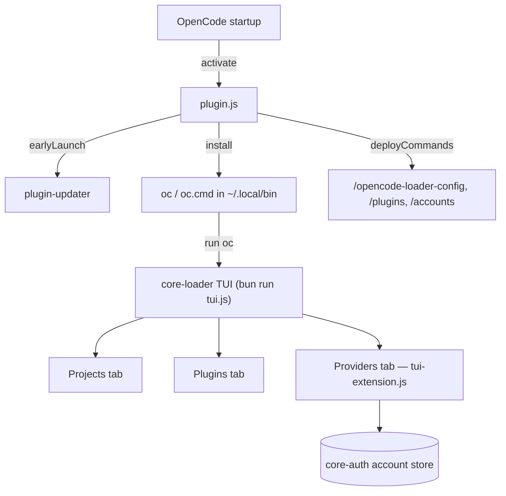

# opencode-loader

[](https://www.npmjs.com/package/opencode-loader)
[](https://www.npmjs.com/package/opencode-loader)
[](https://github.com/intisy-ai/opencode-loader/actions/workflows/publish.yml)
[](LICENSE)

TUI launcher and `oc` shell command for [OpenCode](https://github.com/sst/opencode). When loaded as an OpenCode plugin it installs an `oc` command into your shell; running `oc` opens an interactive TUI for switching between projects, managing plugins, and signing in to providers. It also drives [plugin-updater](https://github.com/intisy-ai/plugin-updater) on startup so all your git-based plugins stay current.

## Under-the-Hood Architecture



## Structure

- `src/plugin.ts` — the OpenCode plugin entry (`activate`/`cleanup`); installs the `oc` wrapper, runs plugin-updater, deploys commands. Also acts as the command CLI (`node plugin.js <config|plugins|accounts>`).
- `src/tui-extension.ts` — the loader's custom Providers tab (auto-discovers installed providers).
- `src/commands.ts` — cross-app slash-command definitions + their CLI actions.
- `core-loader/` — git submodule ([`intisy-ai/core-loader`](https://github.com/intisy-ai/core-loader)): the TUI engine (`core-loader/dist/tui.js`), built and bundled at publish time.
- `core/` — git submodule ([`intisy-ai/core`](https://github.com/intisy-ai/core)): shared config + the cross-app command framework, bundled to `core/dist/index.js`.
- `dist/` — compiled output (generated; not committed).

## Requirements

- [Bun](https://bun.sh/) runtime (the TUI uses `bun:sqlite` to read the OpenCode session database).

## Installation

### Via plugin-updater (recommended)
Add to `~/.config/opencode/config/plugins.json`:
```json
{ "name": "opencode-loader", "url": "https://github.com/intisy-ai/opencode-loader", "enabled": true, "autoUpdate": true }
```
Restart OpenCode — the updater clones, builds (including the submodules), and loads it.

### Via npm
Add the package to `~/.config/opencode/opencode.json`:
```jsonc
{ "plugins": ["opencode-loader@latest"] }
```

## Usage

```bash
oc              # Launch the TUI
oc 3            # Open project #3 directly
oc myproject    # Open the first project matching "myproject"
```

### Keyboard shortcuts

| Key | Projects tab | Plugins tab |
|-----|--------------|-------------|
| ↑↓ / W S | Navigate | Navigate |
| Enter | Open action menu | Open action menu |
| O | Open project | — |
| P | Pin/Unpin | — |
| H / U | Hide / Unhide all | — |
| F | — | Fetch remote updates |
| A | — | Toggle auto-update |
| ← → | Switch tabs | Switch tabs |
| Q | Quit | Quit |

## Commands

Deployed automatically on activation to both apps' command directories (`~/.config/opencode/command/` and `~/.claude/commands/`):

| Command | Description |
| --- | --- |
| `/opencode-loader-config` | View/change loader config (`opencode-loader.json`): `list`, `get <key>`, `set <key> <value>`. 100% of the config is reachable here. |
| `/plugins` | List the loader-managed plugins and their state (from `plugins.json`). |
| `/accounts` | List signed-in accounts across all providers (from the core-auth store). |

## Configuration

> Config files are **auto-created with defaults on first run** (via core `ensureConfig`). **Global console logging** for every plugin is toggled in `config/settings.json` (`logConsole: true`, the opencode.json-equivalent).

Config file: `~/.config/opencode/config/opencode-loader.json` (preferred) or `~/.config/opencode/opencode-loader.json` (fallback).

| Key | Type | Default | Description |
| --- | --- | --- | --- |
| `logging` | boolean | `true` | Write a per-session log file. Set `false` to disable. |

The TUI also stores its own settings in `config/oc-config.json` and the plugin list in `config/plugins.json`.

## Dependencies

- **`core-loader`** (required) — bundled git submodule providing the TUI engine.
- **`core`** (required) — bundled git submodule (config + command framework).
- **`plugin-updater`** (recommended) — run on startup to keep git-based plugins updated; absent, the loader skips updates.
- **Bun** (required) — runtime for the TUI.

## Logging

Logs to `~/.config/opencode/logs/YYYY-MM-DD/opencode-loader-HH-MM-SS.log`. Set `"logging": false` in config to disable.

## License

MIT
